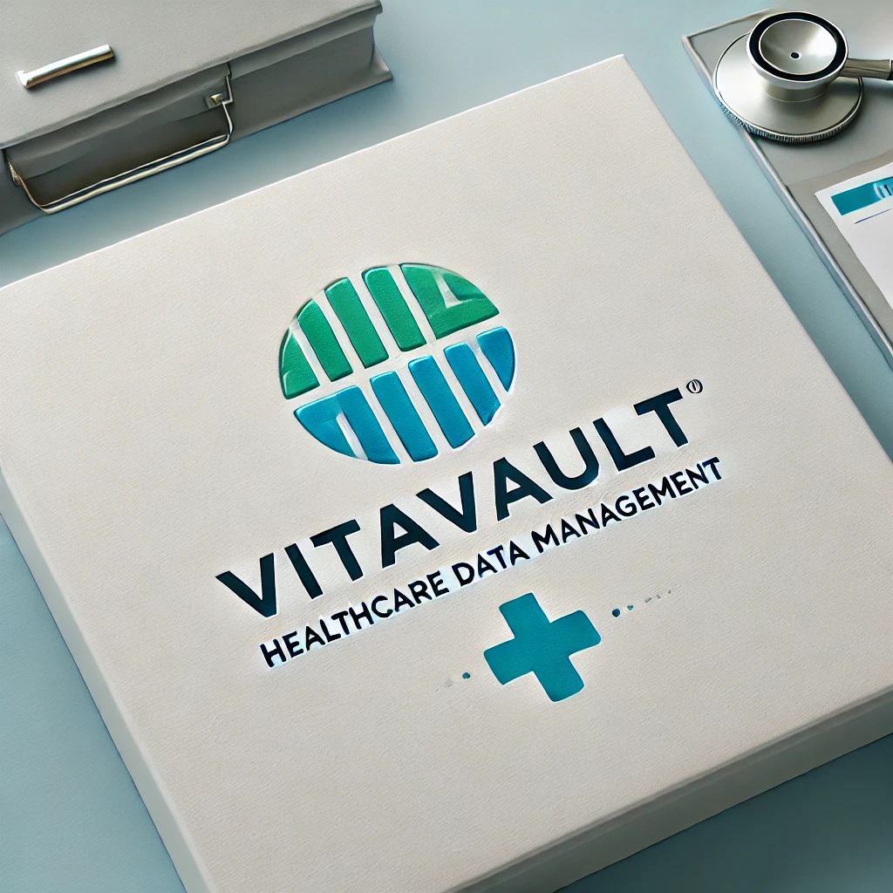

# ¡Welcome to VitaVault! #


**Comprehensive Healthcare Data Management System**

## Overview

**VitaVault** is a comprehensive information management system tailored specifically for healthcare institutions. It provides an efficient and unified solution for medical data management, care coordination, and process optimization within healthcare environments. Built around a robust GraphQL API, VitaVault ensures rapid, flexible, and precise data handling.

## Key Features

- **Patient and Personal Data Management:**

  - Centralized handling of patient demographics and health records.
  - Comprehensive patient identification and coverage plan integration.

- **Appointment and Schedule Coordination:**

  - Efficient scheduling and management of medical appointments.
  - Real-time tracking of medical resource availability.

- **Hospital Resource Management:**

  - Detailed management of beds, rooms, and healthcare facilities.
  - Real-time tracking of resource availability and status.

- **Clinical Records and Episodes:**

  - Detailed episode tracking and associated medical records.
  - Integration of medical notes and physician directives.

- **Billing and Healthcare Coverage:**

  - Streamlined billing processes and insurance plan management.
  - Integrated tracking of patient financial interactions and coverage details.

- **User Roles and Access Management:**

  - Role-based access control to enhance security and data integrity.

## Technology Stack

- **Backend:** Java with Spring Boot 3
- **API Layer:** GraphQL (Spring for GraphQL)
- **Database:** MySQL (via JPA/Hibernate)
- **Utilities:** Lombok
- **Build Tool:** Maven

## Repository Structure

```
vitavault/
├── assets/
├── src/
│   ├── main/
│   │   ├── java/com/vitavault/vitavault/
│   │   │   ├── configuration/
│   │   │   ├── controller/ (GraphQL controllers)
│   │   │   ├── model/ (Domain entities and input objects)
│   │   │   ├── repository/ (Data access repositories)
│   │   │   ├── service/ (Business logic)
│   │   │   └── util/ (Common utilities)
│   │   └── resources/
│   │       └── graphql/ (GraphQL schema definitions)
├── pom.xml
└── README.md
```

## Use Cases & Real-World Applications

- **Unified Medical Record Systems:** Centralized storage for patient clinical history and demographics.
- **Hospital Resource Management:** Real-time tracking of room and bed occupancy.
- **Appointment Scheduling:** Efficient management of healthcare provider schedules and patient appointments.
- **Integrated Billing Systems:** Simplified management of patient billing and healthcare coverage.

## Getting Started

Clone the repository:

```bash
git clone https://github.com/NazaTarrili/VitaVault.git
```

Update `application.properties` with your MySQL credentials and run using Maven:

```bash
./mvnw spring-boot:run
```

## API Documentation

The GraphQL API schema is defined under `src/main/resources/graphql`. Access the GraphQL endpoint through the configured server URL after running the application.

---

VitaVault is designed for extensibility, making it suitable for hospitals, clinics, and healthcare institutions aiming for digital transformation and optimized care coordination.

